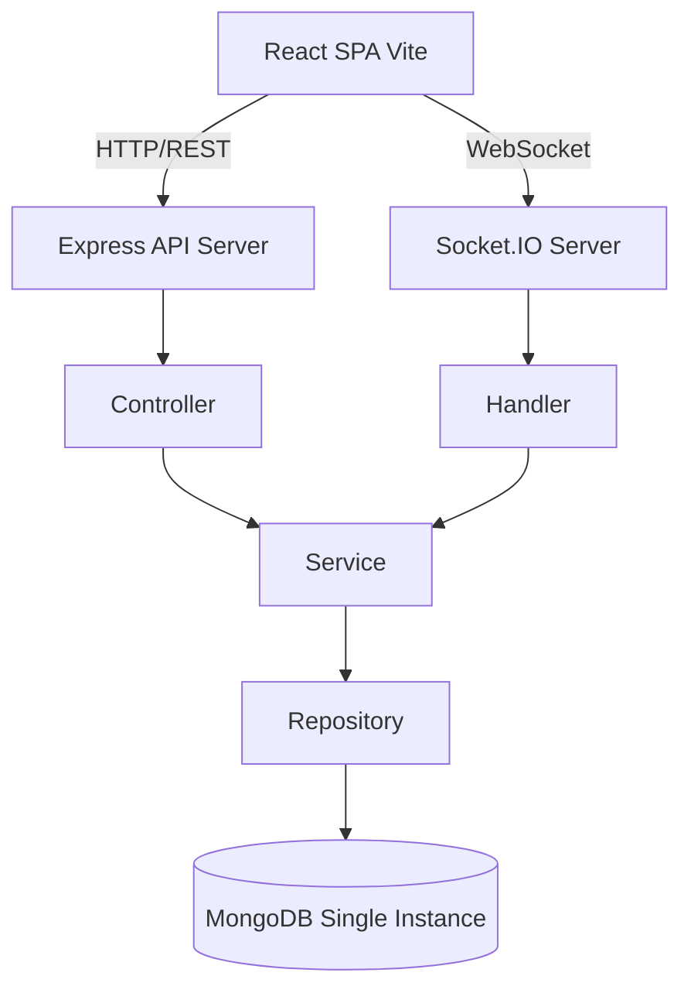
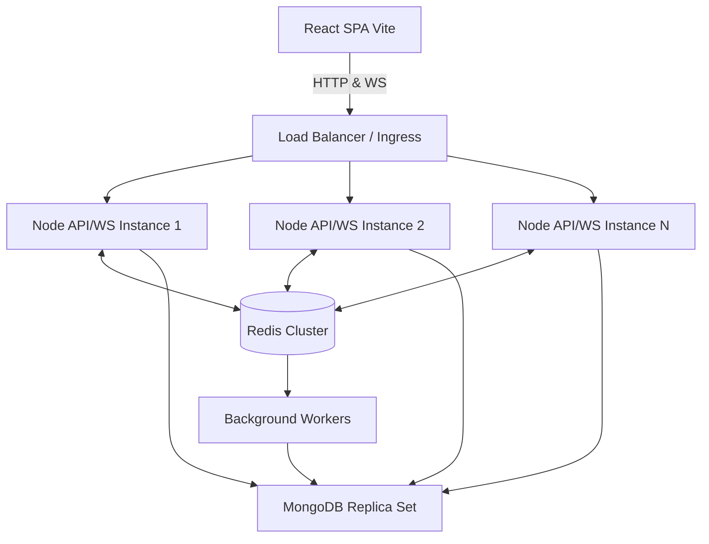

# Real-Time Analytics Dashboard - Architecture Review

## A. Current Architecture Diagram

*Note: The API and WS run on the same Express instance. The architecture currently relies on a single monolithic backend container holding both REST API and WebSocket connections.*

## B. Current Bottlenecks

1. **Stateful WebSockets:** Socket.IO connections are currently stateful and tied to a single Node.js instance. Scaling to multiple instances will cause connection issues and dropped messages for clients on different servers.
2. **Database Load:** Every API request directly queries MongoDB. As data grows (especially analytics data), heavy analytical queries will block the event loop and degrade real-time performance.
3. **Missing Caching Layer:** There is no in-memory cache (like Redis). Frequent queries (like dashboard KPIs or user sessions) hit the DB every time.
4. **No Rate Limiting:** The API is vulnerable to abuse and DoS attacks since there's no rate limiting on endpoints (especially authentication).
5. **No Background Jobs:** Any heavy computation or data aggregation runs on the main request-response cycle, risking blocking the Node.js event loop.
6. **Synchronous Authentication:** Currently, JWT validation is done synchronously on every protected route. Lack of refresh tokens means short-lived sessions or insecure long-lived tokens.
7. **Single Point of Failure (SPOF):** The entire application relies on a single Node server and a single MongoDB instance.

## C. Target Production Architecture

**Key Improvements:**
* **Horizontal Scaling:** Multiple Node.js instances behind a Load Balancer (e.g., NGINX, AWS ALB).
* **Redis Pub/Sub:** Redis adapter for Socket.IO to broadcast events across all Node instances.
* **Redis Caching:** Caching frequently accessed data and session management.
* **Message Queue / Workers:** Offloading heavy analytics processing to background worker processes using Redis (e.g., BullMQ).
* **MongoDB Replica Set:** For high availability and read scalability (secondary nodes for heavy read queries).
* **Security & Observability:** API Gateway for Rate Limiting, Helmet, Prometheus metrics, and Datadog/ELK for centralized logging.

## D. Prioritized Migration Plan

### Phase 1: Security & Stability (Immediate)
1. Implement Rate Limiting (`express-rate-limit`) on API routes (especially auth).
2. Add Helmet (`helmet`) for secure HTTP headers.
3. Implement graceful shutdown handling for Express, Socket.IO, and Mongoose.
4. Add basic health checks (`/health` and `/ready`) that verify DB connectivity.

### Phase 2: Scalability Prep (Short-Term)
1. **Introduce Redis:** Add Redis to the Docker Compose setup.
2. **Socket.IO Redis Adapter:** Implement `@socket.io/redis-adapter` to allow horizontal scaling of web sockets.
3. **Caching:** Implement Redis caching for frequent, heavy database queries.
4. **Connection Pooling:** Optimize Mongoose connection pooling for higher concurrency.

### Phase 3: Architectural Decoupling (Medium-Term)
1. **Background Processing:** Extract heavy analytics calculations out of Express routes/services and into background jobs (e.g., BullMQ).
2. **Enhanced Auth:** Implement Refresh Tokens and store active sessions in Redis to allow revoking access.
3. **Multi-Tenancy Foundation:** Update MongoDB schemas to include a `tenantId` field and update repositories to scope queries by tenant.

### Phase 4: Production Readiness (Long-Term)
1. **Observability:** Expose Prometheus metrics and aggregate logs.
2. **CI/CD:** Create GitHub Actions workflows for automated testing, linting, and Docker image building.
3. **MongoDB:** Move from single instance to a Replica Set or a managed service like MongoDB Atlas.

## E. Risks and Tradeoffs

* **Complexity vs. Maintainability:** Introducing Redis and background workers adds moving parts. We must ensure robust error handling and monitoring for these components.
* **Data Consistency:** Caching with Redis introduces potential staleness. We must implement proper cache invalidation strategies when underlying MongoDB data changes.
* **WebSocket Stickiness:** When horizontally scaling, the Load Balancer MUST be configured for session stickiness (IP hash) or we must strictly rely on websockets (no polling fallback) if stickiness isn't possible, though Redis adapter mitigates multi-server pub/sub issues.
* **Migration Downtime:** Transitioning to multi-tenancy might require significant schema migrations which could cause downtime if not handled with zero-downtime migration patterns.

## F. Files that need modification (High Level)

1. `server/server.js`: Add Helmet, rate limiting, and graceful shutdown handlers. Update route configurations.
2. `server/socket/index.js`: Integrate Redis adapter for Socket.IO.
3. `server/config/db.js`: Add connection pooling configuration.
4. `server/controllers/*` & `server/services/*`: Implement Redis caching logic.
5. `server/models/*`: Update schemas for indexing and multi-tenancy (`tenantId`).
6. `server/package.json`: Add new dependencies (`redis`, `@socket.io/redis-adapter`, `express-rate-limit`, `helmet`, `bullmq`).
7. `docker-compose.yml`: Add Redis service, adjust environment variables.
8. `client/src/services/socket.js` (or equivalent): Ensure robust reconnection and error handling logic for WebSockets.

## G. Recommended Implementation Order

1. **Security Basics:** Helmet, Rate Limiting, Graceful Shutdown. (Quick wins, low risk)
2. **Redis & Socket Adapter:** Infrastructure change required before adding a second instance.
3. **Caching Layer:** Improves performance on single instance, prepares for scale.
4. **Background Jobs:** Offloads heavy work, significantly stabilizing API response times.
5. **Multi-tenancy:** Complex schema migration, requires extensive testing. Do this last before full SaaS launch.
